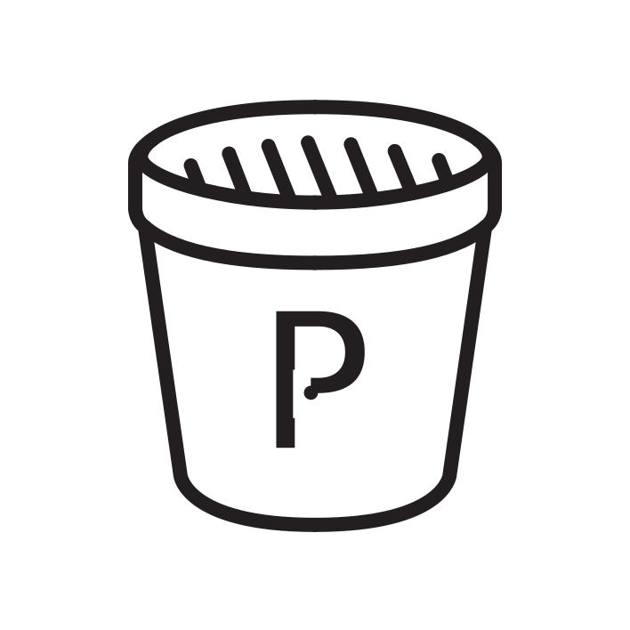

# Planter

<p align='center'></p>

<p align='center'><i>An HTML, CSS, and JS boilerplate for creatives.</i></p>

## Overview

Planter is for folks who want to quickly get started making a static site and utilize tools like Sass and modern JS (ES6+) without a framework, while retaining the simplicity of having little-to-no setup required. It uses:
- `handlebars` for rendering html (at build time),
- `sass` for compiling styling,
- and `babel` for transpiling JavaScript.

Planter is set up with Gulp to watch the Sass, JS, and Handlebars files in `src/` and build their respective output files to `build/`.


## Getting Started

First, download the zip or clone from GitHub.

In the downloaded or cloned directory, run `npm install` to install all the dev dependencies for the project:
```
> npm install
```

To start watching & building your source files, run `gulp develop` (or just `gulp`) in your terminal:
```
> gulp develop
```

If you're cloning, planter includes a quick command you can use to quickly get rid of planter's git history and start fresh: `npm run git-clean`


## Config
[**`planter-config.js`**](./planter-config.js)

The Planter config, `planter-config.js`, allows you to configure settings for the gulp tasks. This config allows you to customize things like the names of your entry and output file names, and change where build/watch tasks look for files if you've modified your project structure, all without needing to update the gulp tasks manually. 

[See the full config docs](./docs/config.md) for a breakdown of each config setting.


## Gulp
[**`gulpfile.js`**](./gulpfile.js)

Planter uses [Gulp](https://gulpjs.com/) building and watching your files. Within `gulpfile.js`, you can can add your own additional tasks, or reconfigure build steps by modifying the existing gulp tasks. These tasks utilize `planter-config.js` for pattern (file) matching and output  paths. 

| command | description |
|:--|:--|
| `gulp` | alias for `gulp develop` |
| `gulp develop` | run build tasks, start watching files, and open dev server using Browsersync |
| `gulp build` | run build tasks ( styles, js, html, and static) |
| `gulp js` | build JS (bundle with `babel`) |
| `gulp styles` | compile SCSS to CSS |
| `gulp html` | builds HTML using handlebars partials, helpers, and data |
| `gulp static` | copy static files to build directory |
| `gulp watch` | same as `gulp develop` but without the dev server |
| `gulp clean` | remove all files from build directory |

Optionally, npm script aliases for the most useful gulp tasks have also been set up in `package.json`:
| command | description |
|:--|:--|
| `npm start` | alias for `gulp` (`gulp develop`) |
| `npm run build` | alias for `gulp build` |
| `npm run clean` | alias for `gulp clean` |


## JavaScript
[**`src/js/`**](./src/js/)

 The file `./src/js/main.js` is used as an entry point for the JS bundle. The `js` gulp task uses `babel` to transpile and `browserify` to bundle `main.js` into a single browser-ready JS file, `bundle.js`. 

### What's an entry point?
Essentially, Browserify uses an entry point file(s) to determine where it should start looking to bundle all the dependencies of _that_ file. You can split your code into multiple files, organize them however you want, in non-browser-friendly syntaxes that you like (Node, ES6, etc.) and then bundle them all into one file that the browser _can_ interpret. 

[Read more about Browserify](https://github.com/browserify/browserify-handbook#how-browserify-works), how it works, and how you could extend this setup to take advantage of code splitting with multiple bundles for more complex projects. 


## Sass (Styles)
[**`src/styles/`**](./src/views/)

The file `./src/styles/style.scss` is used as an entry point for the output `.css` file. By default, the watch task will watch for any `.scss` files in `./src/styles/` to trigger a recompile of the output, regardless of how you organize your Sass and Sass partials.


## Handlebars
[**`src/views/`**](./src/views/)

Out of the box, planter supports using `handlebars` to write your HTML. At the root of `./src/views/`, all `.hbs` and `.html` files are automatically treated as a page by the gulp tasks. For example, `./src/views/index.hbs` gets compiled to `./build/index.html`.

The gulp tasks for building HTML use `gulp-hb` (powered by `handlesbars-wax`) which enables the following:
- Any `.hbs` file within `./src/views/partials/` will be registered as a handlebars partial
- Any `.js` file within `./src/views/helpers` will be registered as a handlebars helper*
- Any `.json` or `.js` file within `./src/data` will be registered as handlebars data**

\* See the `handlebars-wax` [docs regarding registering partials, helpers, and decorators](https://github.com/shannonmoeller/handlebars-wax#registering-partials-helpers-and-decorators) for more info on how to export your modules as helpers, etc.

\*\* See the `handlebars-wax` [docs regarding registering data](https://github.com/shannonmoeller/handlebars-wax#registering-data) for more info on how to register and access data


### Pages
[**`src/views/*.{hbs, html}`**](./src/views/index.hbs)

Any `.hbs` or `.html` file at the root of `src/views/` will be treated as a page. Using the boilerplate partials, you can quickly build a new page using `partials/layout.hbs`:

```hbs
<!-- ./src/views/partials/layout.hbs -->

<!DOCTYPE html>
<html lang="{{@root.site.lang}}">
  <!-- Use ./src/views/partials/head.hbs -->
  {{> head }}
<body>
  <!-- Pass 'page' as context data for nav; for current-page styling -->
  {{> nav this.page }}
  <!-- Use the `block` helper from `handlebars-layouts` -->
  <!-- This defines the "body" block and its default content -->
  {{#block "body"}}
    <script type="text/javascript" src="{{@root.assets.js}}"></script>
  {{/block}}
</body>
</html>
```

```hbs
<!-- example.hbs (example page) -->
<!-- See `./src/views/index.hbs for a working example -->

<!-- Use the `extend` helper from `handlebars-layouts` -->
<!-- `page` should match a valid "name" string. See `partials/nav.hbs` -->
{{#extend "layout" page="example"}}
  <!-- Use the `content` helper from `handlebars-layouts` -->
  <!-- The "body" block is defined within `partials/layout.hbs` -->
  {{#content "body" mode="prepend"}}
    <!-- `mode="prepend"` defines that the body content should be placed
         before the default content defined within `partials/layout.hbs` -->
    <!-- All your page content goes here -->
    <div class="page">
      <div class="demo">
        I'm super cool page content!
      </div>
    </div>
  {{/content}}
{{/extend}}
```

Read more about the helpers from [`handlebars-layouts`](https://github.com/shannonmoeller/handlebars-layouts). 

Note: Since Handlebars is only used for build time to precompile your `.hbs` to `.html`, all Handlebars-related packaces are dev-dependencies only; you can simply not use handlebars and you won't have to worry about any bloat in your build files. 


### Asset Paths
Rather than hard-coding your asset paths relative to their final build directory structure, you can use data passed into handlebars to manage your assets' paths. 

In `gulpfile.js`, the global constant `DATA` constructs an easy way to reference your configured build paths for CSS, JS, and other static assets (e.g. `.jpg`, `.md`, etc.) within handlebars.

For example, to reference an image that you've placed in `./static` (which by default gets copied to `./build/static/` at build time):
Assuming your `planter-config.js` looks like this:
```js
// planter-config.js
module.exports = {
  //...
  build: {
    dir: './build',
    // ...
    static: 'static',
  }
  //...
}
```

In `index.hbs`, you would write an image's `src` value like so:
```hbs
<img src="{{@root.assets.static}}/planter-logo.svg"
```

This way, if you modify your build paths in `planter-config.js`, you don't need to manually update all your path references.

Read more about `planter-config.js`'s build options in the [config docs](./docs/config.md).

The `@root` is an accessor for the pre-registered data loaded in the html build task. `@root.assets` is defined by `DATA.assets` (in `gulpfile.js`).

```js
// gulpfile.js

/* 
 * The data passed here from config is also used by the build tasks.
 * To change the file paths of your build assets, you should modify
 * `planter-config.js` so the changes will be known to both this global
 * data and the build tasks.
 */
const DATA = {
  //...
  assets: {
    // The full path for the compiled CSS output
    css: /* ... */,
    // The full path for the bundled JS output
    js: /* ... */,
    // The path prefix (i.e. directory) for static files
    static: /* ... */,
  }	
}
```

[Read more about `@root`](https://github.com/shannonmoeller/gulp-hb#template-context) and the template context in the `gulp-hb` docs.

## Static Assets
[**`static/`**](./static/)

Static assets like images, videos, fonts, and other documents can all be placed within the `static` directory. This entire directory will be directly copied to the build directory (e.g. `./static/planter-logo.svg` gets copied to `./build/static/planter-logo.svg`).

### Favicon
[**`static/favicon.ico`**](./static/)

By default, the `static` gulp task handles `favicon.ico` separately: it copies it from `./static` to the root of `./build`.
